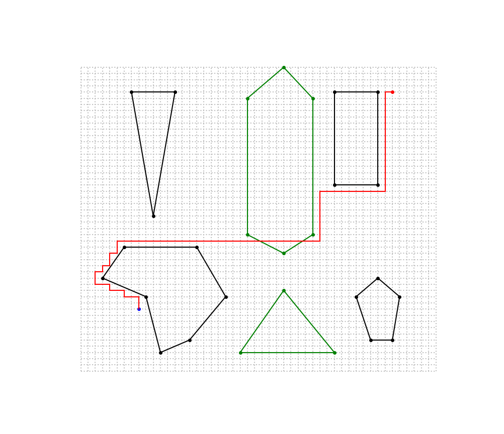

# Grid Pathfinding – README

Welcome to the **Grid Pathfinding** project! This program allows you to visualize and run various graph search algorithms (**BFS**, **DFS**, **GBFS**, and A\* ) on a 2D grid with obstacles and “turf” areas.

---

## Features

1. **Multiple World Configurations**:
   - **Default Path (Option 1)** loads polygons (obstacles and turfs) from `TestingGrid/world1_enclosures.txt` and `TestingGrid/world1_turfs.txt`.
   - **Custom Path (Option 2)** loads polygons from `TestingGrid/enclosures.txt` and `TestingGrid/turfs.txt`.

2. **Source and Destination Points**:
   - **Default**: `(8, 10)` to `(43, 45)` for the first world.
   - **Custom**: `(15, 20)` to `(43, 45)` for the second world.
   - You can easily modify these coordinates in `search.py` to pick new start or goal points.
   - Source and destination points are marked with **`blue`** and **`red`** dots, respectively.

3. **Available Search Algorithms**:
   - **BFS (Breadth-First Search)**
   - **DFS (Depth-First Search)**
   - **GBFS (Greedy Best-First Search)**
   - **A\* (A-Star) Search**

4. **Obstacle and Turf Visualization**:
   - **Enclosures** (black polygons) are obstacles you cannot pass through.
   - **Turfs** (green polygons) are areas with a slightly higher step cost, but they can still be traversed.

5. **Real-Time Visualization**:
   - Uses **Matplotlib** to draw the grid and polygons.
   - The **red line** is drawn step by step to show the solution path.

---

## Installation

1. Clone or download the repository.
2. Make sure you have the required dependencies:
   ```bash
   pip install matplotlib numpy
   ```
3. (Optional) If you use virtual environments, ensure you have one activated with the dependencies installed.

---

## How to Run

1. Open a terminal or command prompt in the **project directory**.
2. Run:
   ```bash
   python search.py
   ```
   (Or any environment-specific command to run a Python file.)

3. You’ll see an ASCII welcome banner. The program then prompts:
   ```
   Choose the search grid Path first:
    1. Default Path
    2. Custom Path
   Enter Choice:
   ```
   - **Type `1`** for the default path/polygons (e.g., `world1_enclosures.txt`).
   - **Type `2`** for the custom path/polygons (`enclosures.txt`).

4. Next, you’ll see:
   ```
   Enter the search algorithm to use:
    1. BFS
    2. DFS
    3. GBFS
    4. A*
   Enter Choice:
   ```
   - **Type `1`** for **BFS**,
   - **`2`** for **DFS**,
   - **`3`** for **GBFS**,
   - **`4`** for **A***.

5. The program **constructs** the polygons, draws them, and **plots** your **source** and **destination** points.  
   Then, it **executes** the chosen search algorithm. If a path is found, you’ll see the **red line** animate across the grid from start to goal.

---

## Sample Console Session

Below is an example of what you might see when running the program:

```
WELCOME TO

     _____                     _        ___  _                  _ _   _                   
    /  ___|                   | |      / _ \| |                (_) | | |                  
    \ `--.  ___  __ _ _ __ ___| |__   / /_\ \ | __ _  ___  _ __ _| |_| |__  _ __ ___  ___
     `--. \/ _ \/ _` | '__/ __| '_ \  |  _  | |/ _` |/ _ \| '__| | __| '_ \| '_ ` _ \/ __|
    /\__/ /  __/ (_| | | | (__| | | | | | | | | (_| | (_) | |  | | |_| | | | | | | | \__ \
    \____/ \___|\__,_|_|  \___|_| |_| \_| |_/|_|\__, |\___/|_|  |_|\__|_| |_|_| |_| |_|___/
                                                __/ |                                     
                                               |___/                                      

Choose the search grid Path first:
 1. Default Path
 2. Custom Path
 Enter Choice:1
Enter the search algorithm to use:
 1. BFS
 2. DFS
 3. GBFS
 4. A*
 Enter Choice:4

[Search visualizing on the grid...]
[The path (in red) draws gradually from the source to the destination...]
[Once the path is complete, the nodes expanded and total path cost will be appended in the summary.txt file...]
[Program ends...]
```

Finally, a **Matplotlib** window opens, showing the grid, polygons, and the path. 

See image below for the default path with A\* search:


---

## Customizing the Start/Goal

In `search.py`, edit:
```python
source = Point(8, 10)
dest = Point(43, 45)
```

...to any valid coordinates `[0..49, 0..49]`.

---

## Using a Different Algorithm Implementation

Switch the calls in `search.py` from:
```python
res_path = GridPathFinder(source, dest, epolygons, tpolygons).bfs()
```
to, for example:
```python
res_path = GridPathFinder(source, dest, epolygons, tpolygons).dfs()
```
or `.gbfs()`, `.aStar()`, etc.

---

## Additional Notes

- The **`actionCost`** function in `GridPathFinder` assigns a **1.5** cost to green turf squares and **1.0** cost otherwise.
- If you need to see the total path cost and expansions, use the **`*WithStats`** variants (e.g., `bfsWithStats()`).

---

## Troubleshooting

- If **no path** is found or you see an **error**:
  - Check that your start and goal points are not **inside** an enclosure (black polygon).
  - Verify the text files in the `TestingGrid` folder are correctly formatted.
  - Ensure **matplotlib** is installed and functioning.

